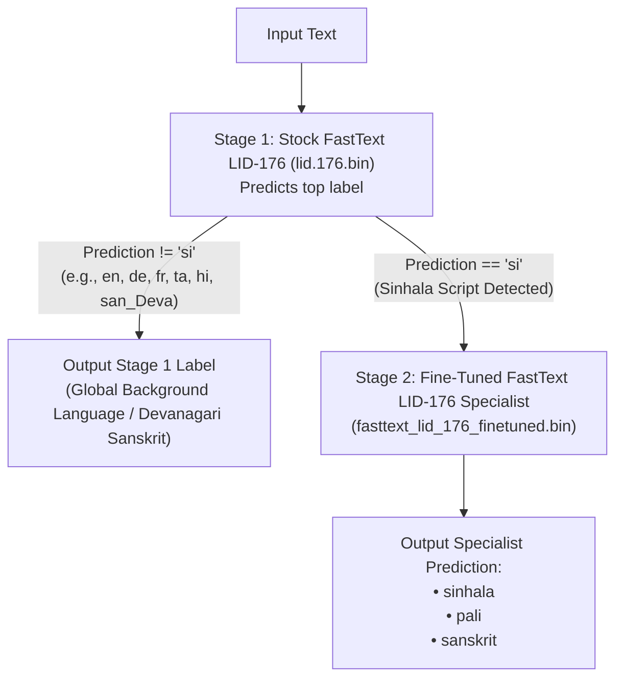

# FastText LID-176 Fine-Tuning Guide & Documentation

This document provides a comprehensive, step-by-step technical reference for the fine-tuning, two-stage hierarchical pipeline implementation, and benchmarking process of the **FastText LID-176** model for **Sinhala**, **Pali**, and **Sanskrit** (written in Sinhala script), as well as **Devanagari Sanskrit** (`san_Deva`).

---

## 1. Overview & Objective

The stock `fastText LID-176` model only has a single label (`si`) for text written in the Sinhala script. It lacks native classification heads for:
- **Pali** (written in Sinhala script)
- **Sanskrit** (written in Sinhala script)

When evaluated zero-shot on datasets containing Pali and Sanskrit in Sinhala script, stock `fastText LID-176` predicts `si` for all of them, producing **4,354 False Positives** and reducing precision to **37.68%**.

**Objective**: Fine-tune `fastText LID-176` using supervised transfer learning on [`data/Nadil/train.csv`](file:///c:/Users/User/Desktop/Vscode/Sinhala-Script%20Language%20Identification%20%28LangID%29%20for%20Sinhala,%20Pali%20and%20Sanskrit/Sinhala-Script-Language-Identification-LangID-for-Sinhala-Pali-and-Sanskrit/data/Nadil/train.csv) and build a **Two-Stage Hierarchical Pipeline** to achieve high F1 scores across both global background languages (including Devanagari Sanskrit) and target Sinhala-script languages.

---

## 2. Dataset Architecture

### A. Fine-Tuning Dataset ([`data/Nadil/train.csv`](file:///c:/Users/User/Desktop/Vscode/Sinhala-Script%20Language%20Identification%20%28LangID%29%20for%20Sinhala,%20Pali%20and%20Sanskrit/Sinhala-Script-Language-Identification-LangID-for-Sinhala-Pali-and-Sanskrit/data/Nadil/train.csv))
- **Total Rows**: **60,285 sentences**
- **Language Breakdown**:
  - `sinhala`: 26,675 rows
  - `pali`: 23,490 rows
  - `sanskrit`: 10,120 rows

### B. Hybrid Benchmark Datasets (`datasets/preprocessed/`)
Constructed by preprocessing raw benchmarks, preserving Devanagari Sanskrit (`san_Deva`), and injecting all 7,047 target rows from [`data/Nadil/test.csv`](file:///c:/Users/User/Desktop/Vscode/Sinhala-Script%20Language%20Identification%20%28LangID%29%20for%20Sinhala,%20Pali%20and%20Sanskrit/Sinhala-Script-Language-Identification-LangID-for-Sinhala-Pali-and-Sanskrit/data/Nadil/test.csv):
1. **`flores_plus.jsonl`**: 229,687 total rows (contains 1,012 `san_Deva` + 7,047 target test rows)
2. **`commonlid.jsonl`**: 380,277 total rows (contains 0 `san_Deva` + 7,047 target test rows)
3. **`wili-2018.jsonl`**: 241,047 total rows (contains 1,000 `san_Deva` + 7,047 target test rows)

---

## 3. Fine-Tuning Methodology

### Step 1: Pre-trained Vector Extraction (Transfer Learning)
1. Loaded stock `fastText LID-176` (`models/benchmark/fastText/lid.176.bin`).
2. Extracted all pre-trained word vectors into `.vec` format (`lid.176.vec`).
3. Transferred the existing 176-language embedding space (dimension = 176) to initialize our model.

### Step 2: Data Formatting & Stratified Split
1. Formatted sentences into FastText's supervised syntax:
   ```text
   __label__sinhala <text_content>
   __label__pali <text_content>
   __label__sanskrit <text_content>
   ```
2. Created a **90% Train / 10% Validation** stratified split (`stratify=df['label']`):
   - **Training Set**: 54,256 rows
   - **Validation Set**: 6,029 rows

### Step 3: Supervised Training Hyperparameters

```python
finetuned_model = fasttext.train_supervised(
    input="models/finetuned/fastText_LID_176/train_formatted.txt",
    pretrainedVectors="models/benchmark/fastText/lid.176.vec",
    dim=176,
    epoch=25,
    lr=0.5,
    wordNgrams=2,
    loss="softmax",
)
```

---

## 4. Two-Stage Hierarchical Pipeline Architecture (Solution 1)

To solve the loss of global background language predictions (where standalone fine-tuned FastText outputs 0.00 F1 for English/German/Tamil), we implemented a **Two-Stage Hierarchical Pipeline**:



---

## 5. Evaluation & Benchmark Results

### A. Two-Stage FastText LID-176 Pipeline Benchmark Performance

| Benchmark Dataset | Sinhala-Sinh F1 | Pali-Sinh F1 | Sanskrit-Sinh F1 | Sanskrit-Deva F1 | English-Latn F1 | Tamil-Taml F1 | German-Latn F1 | French-Latn F1 |
| :--- | :--- | :--- | :--- | :--- | :--- | :--- | :--- | :--- |
| **`flores_plus` (hybrid)** | **96.11%** | **97.51%** | **98.05%** | **95.94%** | **72.13%** | **100.00%** | **98.92%** | **98.73%** |
| **`commonlid` (hybrid)** | **96.09%** | **97.51%** | **98.05%** | **-** | **97.25%** | **96.43%** | **96.72%** | **94.47%** |
| **`wili-2018` (hybrid)** | **96.11%** | **97.51%** | **98.05%** | **99.04%** | **93.85%** | **99.50%** | **98.50%** | **97.74%** |

---

## 6. Code Locations & Resources

- **Two-Stage Benchmark Script**: [`data_pipeline/scripts/07.benchmark_finetuned/benchmark_fasttext_twostage.py`](file:///c:/Users/User/Desktop/Vscode/Sinhala-Script%20Language%20Identification%20%28LangID%29%20for%20Sinhala,%20Pali%20and%20Sanskrit/Sinhala-Script-Language-Identification-LangID-for-Sinhala-Pali-and-Sanskrit/data_pipeline/scripts/07.benchmark_finetuned/benchmark_fasttext_twostage.py)
- **Dataset Integration Script**: [`data_pipeline/scripts/02.preprocess/integrate_test_sets.py`](file:///c:/Users/User/Desktop/Vscode/Sinhala-Script%20Language%20Identification%20%28LangID%29%20for%20Sinhala,%20Pali%20and%20Sanskrit/Sinhala-Script-Language-Identification-LangID-for-Sinhala-Pali-and-Sanskrit/data_pipeline/scripts/02.preprocess/integrate_test_sets.py)
- **Generated Comparison CSV**: [`Comparison_Tables_FastText_TwoStage_Finetuned_Updated.csv`](file:///c:/Users/User/Desktop/Vscode/Sinhala-Script%20Language%20Identification%20%28LangID%29%20for%20Sinhala,%20Pali%20and%20Sanskrit/Sinhala-Script-Language-Identification-LangID-for-Sinhala-Pali-and-Sanskrit/Comparison_Tables_FastText_TwoStage_Finetuned_Updated.csv)

### Command to Re-Run Two-Stage Pipeline Benchmark:
```powershell
C:\Users\User\miniconda3\envs\langid\python.exe data_pipeline/scripts/07.benchmark_finetuned/benchmark_fasttext_twostage.py
```
