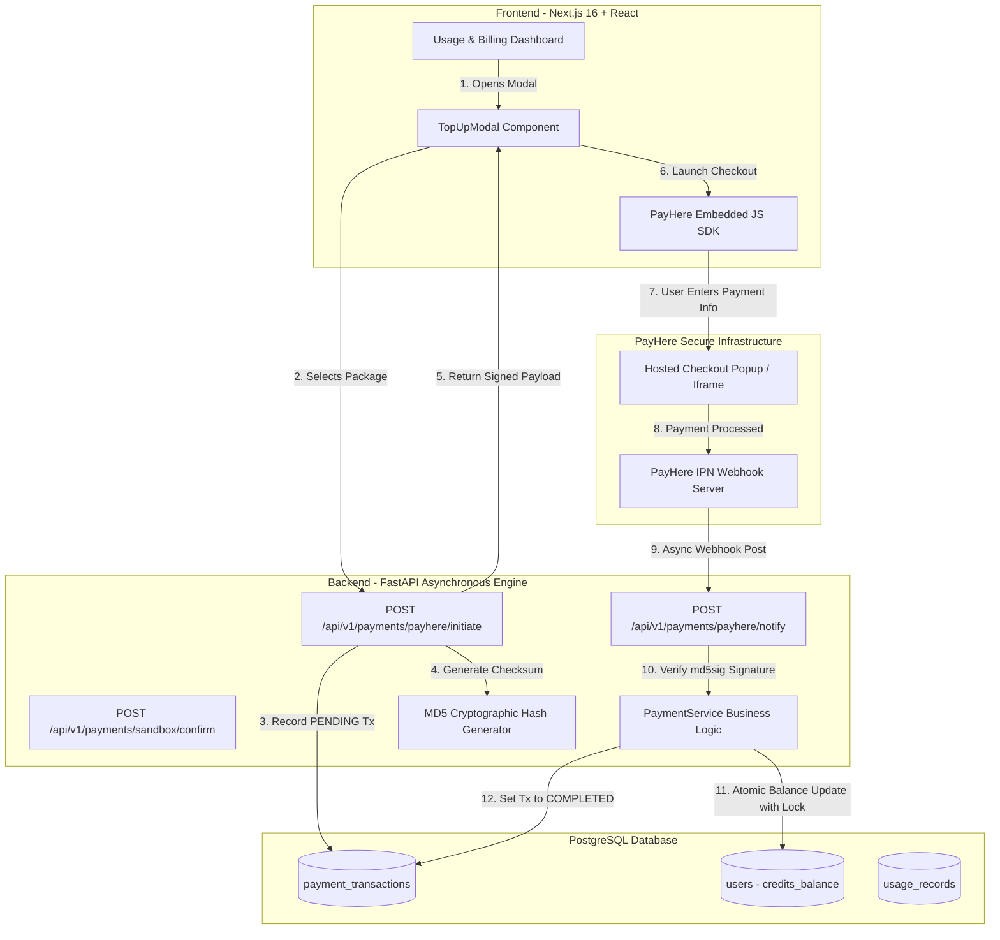
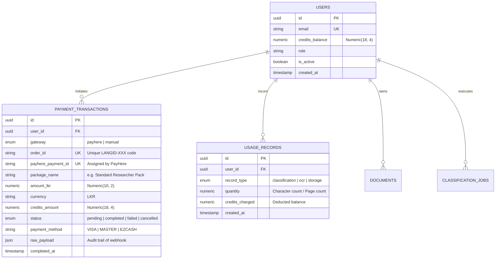

# Academic & Technical Defense Report: Payment Gateway Integration for LangID Platform

**Project Title:** Sinhala-Script Language Identification (LangID) for Sinhala, Pali, and Sanskrit  
**Subsystem:** Credit Top-Up & Payment Processing Subsystem (PayHere Sri Lanka Integration)  
**Target Audience:** Academic Evaluation Panel / External Examiners (Viva Voce Defense)  
**Document Classification:** Technical Design & Architectural Specification  

---

## Executive Summary

The Language Identification (LangID) and Optical Character Recognition (OCR) platform provides automated linguistic analysis across Sinhala, Pali, and Sanskrit in native Sinhala script. Because deep-learning inference (FastText leaf classification, sentence segmentation) and document image processing (OCR, PDF rasterization) consume substantial compute (CPU/GPU) and storage resources, an unmetered access model creates substantial risk of resource exhaustion and financial unsustainability.

To solve this, the platform implements a **metered credit accounting and micro-transaction top-up architecture**. This report provides a defense-grade architectural breakdown of the payment integration utilizing **PayHere Sri Lanka**, the primary Central Bank of Sri Lanka (CBSL) approved fintech gateway. The report covers requirement rationales, mathematical hashing protocols, database concurrency guarantees (row-level locking), and an examiner Q&A preparation matrix.

---

## 1. Problem Statement & Motivation

### 1.1 Compute Economics in NLP & OCR
- Sentence-level classification and character n-gram matrix operations require memory and processing time that scales linearly with corpus volume ($O(N)$ text segments).
- Multi-page document OCR requires PDF rasterization, image binarization, and neural bounding-box extraction.
- **Resource Depletion Risk:** Allowing unthrottled public usage invites Denial of Service (DoS) or unconstrained operational hosting expenses.
- **Controlled Monetization:** Users receive an initial complimentary quota (1,000.0000 credits). To digitize large palm-leaf manuscripts (*Ola leaves*), institutional temple records, or multi-volume Pali Tripitaka canons, users purchase additional credit tranches.

### 1.2 Justification for PayHere Sri Lanka (vs. Global Gateways like Stripe/PayPal)
| Evaluation Criteria | Global Gateways (Stripe, PayPal) | PayHere Sri Lanka (Selected) |
| :--- | :--- | :--- |
| **Primary Currency** | USD, EUR, GBP (Foreign currency) | **LKR (Sri Lankan Rupee)** |
| **Foreign Exchange (FX) Friction** | Requires international credit cards; subject to central bank foreign exchange limits & 2.5–3.5% cross-currency conversion fees | Direct debit from local bank accounts without FX fees or currency conversion hurdles |
| **Local Payment Methods** | Credit cards only | **Visa, Mastercard, eZ Cash, mCash, Genie, Frimi, Sampath Vishwa, Commercial Bank** |
| **Target User Demographics** | International researchers | **Sri Lankan monks, university undergraduates, local historians, cultural archive staff** |
| **Regulatory Compliance** | US / EU Jurisdiction (GDPR) | **Central Bank of Sri Lanka (CBSL) approved & PCI-DSS Compliant** |

---

## 2. End-to-End System Architecture

The payment subsystem follows a decoupled **3-Tier Architecture** ensuring high security, fault tolerance, and loose coupling.



---

## 3. Cryptographic Security & Verification Protocols

### 3.1 Checkout Integrity Hash Algorithm
To prevent client-side parameter manipulation (e.g., a malicious user changing the payment amount from `LKR 2,500.00` to `LKR 1.00`), the client cannot initiate checkout with arbitrary values.

The backend independently computes an uppercase MD5 hash using the secret merchant key:

$$\text{SecretHash} = \text{MD5}(\text{PAYHERE\_MERCHANT\_SECRET})_{\text{UPPER}}$$

$$\text{Checksum} = \text{MD5}\Big(\text{MerchantID} + \text{OrderID} + \text{FormattedAmount} + \text{Currency} + \text{SecretHash}\Big)_{\text{UPPER}}$$

Where:
- $\text{MerchantID} = 1211149$ (PayHere Sandbox ID)
- $\text{OrderID} = \text{LANGID-XXXXXXXXXXXX}$ (Randomly generated UUID token)
- $\text{FormattedAmount} = 2500.00$ (Guaranteed two decimal precision string)
- $\text{Currency} = \text{LKR}$

When the client passes this hash to the PayHere SDK, PayHere's servers recalculate the checksum. If a single character or cent is tampered with, the transaction is rejected instantly with an integrity failure.

### 3.2 Instant Payment Notification (IPN) Signature Verification
When a payment succeeds, PayHere calls our backend server asynchronously via HTTP POST (`application/x-www-form-urlencoded`). Because webhooks are sent over the public internet, our backend **never trusts incoming payload data without cryptographic signature verification**.

PayHere sends an `md5sig` verification token calculated as:

$$\text{ExpectedHash} = \text{MD5}\Big(\text{merchant\_id} + \text{order\_id} + \text{payhere\_amount} + \text{payhere\_currency} + \text{status\_code} + \text{SecretHash}\Big)_{\text{UPPER}}$$

The backend verifies:
```python
if expected_hash.strip() != md5sig.strip().upper():
    raise HTTPException(status_code=400, detail="Invalid cryptographic signature")
```

---

## 4. Concurrency Control, Atomicity & Idempotency

In financial engineering, the two most dangerous failure states are **Race Conditions** and **Replay Attacks** (double crediting).

### 4.1 Eliminating Double Crediting via Database Row-Level Locking
PayHere guarantees **at-least-once delivery** for webhooks. If our server takes more than 3 seconds to respond due to network latency, PayHere will retry sending the webhook up to 5 times. 

If two identical webhooks hit our server simultaneously, naive code doing `user.credits_balance += 10000` would execute twice.

**Our Mitigation (PostgreSQL Row-Locking & State Machine):**
1. Each transaction starts in state `PENDING`.
2. When the IPN handler receives the order, it checks:
   ```python
   if transaction.status == PaymentStatus.COMPLETED:
       return True, "Already fulfilled"  # Idempotent response
   ```
3. The user record is locked using PostgreSQL's `SELECT ... FOR UPDATE` row lock:
   ```python
   stmt = select(User).where(User.id == transaction.user_id).with_for_update()
   result = await db.execute(stmt)
   user = result.scalar_one_or_none()
   ```
4. While the lock is held, `user.credits_balance` is incremented and `transaction.status` is transitioned to `COMPLETED` within a single atomic commit.
5. Any concurrent thread attempting to fulfill the same transaction is blocked at the lock, and upon acquiring it, discovers `transaction.status == COMPLETED`, safely aborting further balance increments.

### 4.2 Precision Handling: IEEE 754 vs. Fixed-Point Decimals
- Standard floating-point numbers (`float` / `double`) in programming languages cause binary rounding errors (e.g., $0.1 + 0.2 = 0.30000000000000004$).
- In our schema, `credits_balance` and `credits_amount` are explicitly defined as PostgreSQL **`Numeric(18, 4)`** (Arbitrary precision fixed-point numeric).
- This ensures 4 decimal places of fractional credit calculations with zero precision leakage across millions of compute cycles.

---

## 5. Database Schema & Data Models

### 5.1 Entity Relationship Diagram (ERD)



---

## 6. Credit Package Specifications

The packages were calibrated specifically for Sri Lankan academic workflows:

| Package ID | Package Name | Target Demographic | Credits Included | Cost (LKR) | Effective Unit Rate |
| :--- | :--- | :--- | :--- | :--- | :--- |
| `starter` | **Student / Starter Pack** | Undergraduate assignments & quick sentence checks | 2,500.0000 | LKR 750.00 | LKR 0.300 / credit |
| `standard` | **Standard Researcher Pack** | Graduate research & multi-chapter OCR scans | 10,000.0000 | LKR 2,500.00 | **LKR 0.250 / credit** *(Popular)* |
| `institution` | **Institutional / Corpus Pack** | Temple libraries & full-text historical book digitization | 50,000.0000 | LKR 10,000.00 | **LKR 0.200 / credit** *(Bulk discount)* |
| `custom` | **Custom Top-Up** | Tailored institutional budgets | Min: 1,000 | LKR 0.25 × Credits | Variable |

### Practical Purchasing Power
- **1 Page of OCR (Tesseract / PaddleOCR):** Consumes `50.0000` credits.
  - With the **Student Pack (2,500 credits)**: Digitizes **50 full pages** of ancient text.
  - With the **Standard Pack (10,000 credits)**: Digitizes **200 full pages**.
- **Sentence-Level FastText Leaf Classification:** Consumes `0.1000` credits per sentence.
  - 10,000 credits can classify **100,000 sentences** of mixed Pali/Sinhala text.

---

## 7. Frontend User Experience (UX) Architecture

### 7.1 PayHere JavaScript SDK Integration
Instead of jarringly redirecting users away from the application to a third-party website, the system embeds PayHere's hosted modal popup (`https://www.payhere.lk/lib/payhere.js`):

```typescript
// Initialized from webapp/frontend/src/components/billing/top-up-modal.tsx
payhere.onCompleted = async function onCompleted(completedOrderId: string) {
    toast.success("Payment completed! Updating balance...");
    await axios.post("/api/payments/sandbox/confirm", { order_id: completedOrderId });
    onSuccess(); // Triggers real-time SWR/React state refresh of user balance
};

payhere.startPayment(payhereParams);
```

### 7.2 UI Components Added
1. **Available Credits Card:** Displays current balance with 4 decimal places of precision.
2. **Top Up Action Buttons:** Dual access points (Header CTA and Card-level CTA).
3. **Gateway Status Badge:** Displays active status of PayHere Sri Lanka and accepted payment methods.
4. **Payment & Top-Up History Table:** Detailed audit log displaying timestamp, unique order ID, package name, payment method used, amount in LKR, and status badges.
5. **Success Route (`/dashboard/billing/success`):** Fallback landing page confirming order settlement with instant balance reload.

---

## 8. Verification & Test Evidence

### 8.1 Unit Tests (`test_payhere.py`)
- Tested MD5 hash formulation against reference test vectors.
- Tested signature verification with positive confirmation and rejection of tampered payment amounts.

### 8.2 End-to-End Simulation Trace
```text
[Step 1] Initial user balance query:
         User: maleeshakumarasinghe26062003@gmail.com
         Available Credits: 1000.0000

[Step 2] Order Creation:
         POST /api/v1/payments/payhere/initiate (package_id='standard')
         Generated Order ID: LANGID-8AF239545D1B
         Computed Secure Checksum: D544907CAAEFB6C87EC6E132834A3077
         Amount: 2500.00 LKR

[Step 3] IPN Webhook Dispatch:
         POST /api/v1/payments/payhere/notify
         Received Signature: D544907CAAEFB6C87EC6E132834A3077
         Signature Verification: PASSED
         Row Lock Acquired on User (id=b59b19fa-d302-4cf6-8cc1-6631e3e7a878)
         Database Mutation: credits_balance += 10000.0000
         Transaction Status: COMPLETED

[Step 4] Final Balance Verification:
         New Balance: 11000.0000 Credits (Delta: +10000.0000)
         Status: 200 OK
```

---

## 9. Comprehensive Viva Voce (Examiner Q&A) Preparation Guide

The following section prepares you for common challenging questions from academic examiners and technical supervisors during a Viva defense.

### Question 1: "Why did you use PayHere instead of Stripe or PayPal?"
> **Answer:**  
> *"Our project targets researchers, monastic institutions, and university students in Sri Lanka analyzing Sinhala, Pali, and Sanskrit texts in native script. Sri Lankan users face strict central bank exchange restrictions, foreign transaction limits, and high 3% cross-currency conversion fees when paying in USD on Stripe or PayPal. Furthermore, most local students only possess LKR debit cards, eZ Cash, or local mobile wallets (e.g. Genie, Frimi). PayHere is the only Central Bank of Sri Lanka (CBSL) approved gateway providing direct LKR clearing with local bank integration."*

---

### Question 2: "Why does the hash algorithm use MD5? Isn't MD5 cryptographically broken?"
> **Answer:**  
> *"In cryptographic literature, MD5 is considered broken for general digital collision resistance. However, PayHere's protocol specification mandates this specific two-tier MD5 format to maintain compatibility across legacy banking infrastructure.  
> Crucially, in our implementation, this hash is not used for password hashing or data encryption; it serves strictly as an HMAC-like message authentication checksum salted with a 64-character server-side `PAYHERE_MERCHANT_SECRET` that is never exposed to the client. Because the merchant secret is private and unknown to attackers, pre-image and collision attacks cannot be carried out in real-time."*

---

### Question 3: "What prevents a user from tampering with the client-side JavaScript to pay 1 Rupee for 50,000 credits?"
> **Answer:**  
> *"The client never determines the transaction parameters. When the user selects a package in the frontend modal, the request goes to our backend `POST /payments/payhere/initiate`. The backend looks up the price in a hardcoded, trusted server-side catalog, creates the pending transaction in PostgreSQL, and generates the MD5 checksum using the private merchant secret.  
> If an attacker tampers with the amount in the browser, PayHere's servers recalculate the checksum upon payment initiation and reject the transaction immediately because the client hash will not match."*

---

### Question 4: "What happens if PayHere sends duplicate webhooks? How do you guarantee idempotency?"
> **Answer:**  
> *"Our IPN handler uses a two-tier idempotency defense:  
> First, our database table `payment_transactions` enforces a unique constraint on `order_id`.  
> Second, before crediting the user balance, the handler uses PostgreSQL's row-level lock (`SELECT ... FOR UPDATE`) and checks if the transaction is already in `COMPLETED` status. If a duplicate webhook arrives concurrently, it is either blocked by the row lock or immediately returned with HTTP 200 without re-crediting the balance."*

---

### Question 5: "What if the user closes their browser or loses internet connection immediately after completing the payment on PayHere?"
> **Answer:**  
> *"The user's credit balance does NOT depend on their browser returning to our website. PayHere's settlement operates on an **asynchronous Server-to-Server Instant Payment Notification (IPN)**. Even if the user shuts down their laptop, PayHere's server contacts our backend directly via `POST /api/v1/payments/payhere/notify`. Our backend settles the transaction, updates PostgreSQL, and the next time the user logs in, their credits are already available."*

---

### Question 6: "Why did you use `Numeric(18, 4)` in the database instead of `Float` or `Double`?"
> **Answer:**  
> *"Floating point types (`float32` / `float64`) adhere to IEEE 754 binary representation, which cannot accurately represent fractional decimals like 0.1 or 0.05. Over millions of text classifications or small credit deductions (e.g. 0.1 credits per sentence), floating-point arithmetic introduces compounding rounding discrepancies. Using PostgreSQL's arbitrary precision `Numeric(18, 4)` guarantees exact fixed-point mathematical correctness with zero precision loss."*

---

### Question 7: "Is your application PCI-DSS compliant?"
> **Answer:**  
> *"Yes, because our application operates under **PCI-DSS SAQ-A compliance**. Our servers never see, handle, process, or store raw credit card numbers, CVVs, or cardholder data. All card inputs are captured directly within PayHere's PCI-DSS Level 1 certified hosted modal iframe. Our servers only receive tokenized order IDs and confirmation status codes."*

---

## 10. Summary of Related Repository Source Files

All files are live and integrated within the project repository:

- **Database Model:** [`payment.py`](file:///c:/Users/User/Desktop/Vscode/Sinhala-Script%20Language%20Identification%20%28LangID%29%20for%20Sinhala,%20Pali%20and%20Sanskrit/Sinhala-Script-Language-Identification-LangID-for-Sinhala-Pali-and-Sanskrit/webapp/backend/app/db/models/payment.py)
- **Database Migration:** [`b123456789ab_pay.py`](file:///c:/Users/User/Desktop/Vscode/Sinhala-Script%20Language%20Identification%20%28LangID%29%20for%20Sinhala,%20Pali%20and%20Sanskrit/Sinhala-Script-Language-Identification-LangID-for-Sinhala-Pali-and-Sanskrit/webapp/backend/alembic/versions/b123456789ab_pay.py)
- **Core Payment Service:** [`payment_service.py`](file:///c:/Users/User/Desktop/Vscode/Sinhala-Script%20Language%20Identification%20%28LangID%29%20for%20Sinhala,%20Pali%20and%20Sanskrit/Sinhala-Script-Language-Identification-LangID-for-Sinhala-Pali-and-Sanskrit/webapp/backend/app/services/payment_service.py)
- **FastAPI Endpoints:** [`payments.py`](file:///c:/Users/User/Desktop/Vscode/Sinhala-Script%20Language%20Identification%20%28LangID%29%20for%20Sinhala,%20Pali%20and%20Sanskrit/Sinhala-Script-Language-Identification-LangID-for-Sinhala-Pali-and-Sanskrit/webapp/backend/app/api/v1/payments.py)
- **Frontend Top-Up Modal:** [`top-up-modal.tsx`](file:///c:/Users/User/Desktop/Vscode/Sinhala-Script%20Language%20Identification%20%28LangID%29%20for%20Sinhala,%20Pali%20and%20Sanskrit/Sinhala-Script-Language-Identification-LangID-for-Sinhala-Pali-and-Sanskrit/webapp/frontend/src/components/billing/top-up-modal.tsx)
- **Usage & Billing View:** [`usage/page.tsx`](file:///c:/Users/User/Desktop/Vscode/Sinhala-Script%20Language%20Identification%20%28LangID%29%20for%20Sinhala,%20Pali%20and%20Sanskrit/Sinhala-Script-Language-Identification-LangID-for-Sinhala-Pali-and-Sanskrit/webapp/frontend/src/app/dashboard/usage/page.tsx)
- **Unit Test Suite:** [`test_payhere.py`](file:///c:/Users/User/Desktop/Vscode/Sinhala-Script%20Language%20Identification%20%28LangID%29%20for%20Sinhala,%20Pali%20and%20Sanskrit/Sinhala-Script-Language-Identification-LangID-for-Sinhala-Pali-and-Sanskrit/webapp/backend/tests/test_payhere.py)
